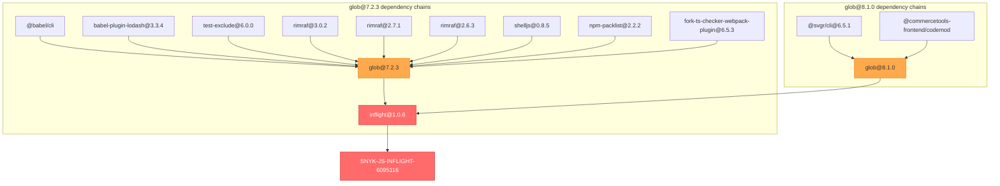
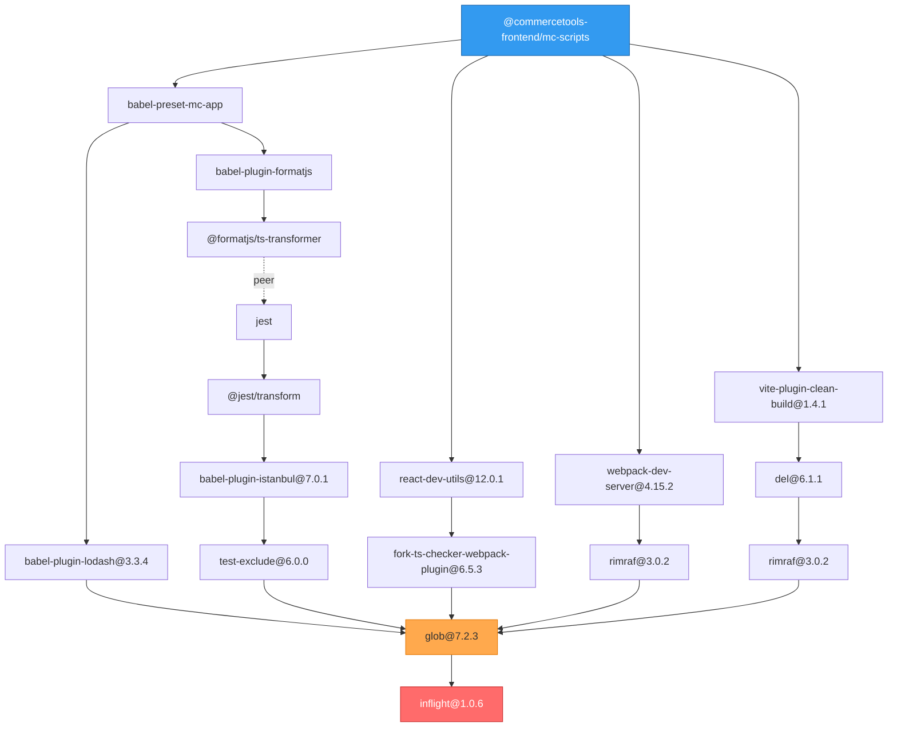
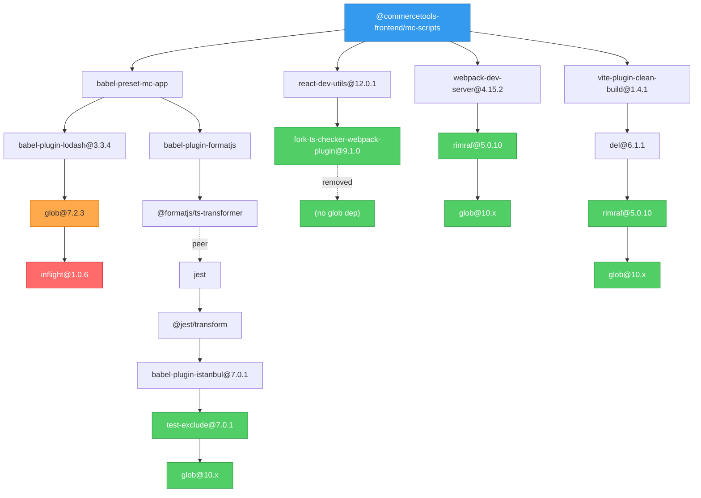
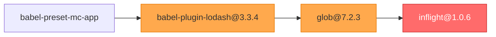

# ADR: Inflight Vulnerability (SNYK-JS-INFLIGHT-6095116) Mitigation

## Status

**In Progress** - Partially mitigated, one dependency path remains.

## Context

### The Vulnerability

[SNYK-JS-INFLIGHT-6095116](https://security.snyk.io/vuln/SNYK-JS-INFLIGHT-6095116) is a **Medium Severity** Regular Expression Denial of Service (ReDoS) vulnerability in the `inflight` package.

- **Package**: `inflight`
- **Severity**: Medium
- **Last Updated**: November 2024 (abandoned)
- **Fix Available**: No - the package is unmaintained

### Why This Is Problematic

The `inflight` package is a transitive dependency of `glob@7.x` and `glob@8.x`. Starting with `glob@9.x`, the maintainer removed the `inflight` dependency entirely. However, many packages in the ecosystem still depend on older glob versions.

The glob maintainer has explicitly stated they will not backport fixes to v7/v8.

### Impact on This Repository

The vulnerability affects `@commercetools-frontend/mc-scripts`, which is shipped to users building Merchant Center customizations. While the vulnerable code only runs at **build time** (not runtime in production), Snyk policies require resolution within SLA.

## Pre-Mitigation State

### Glob Versions Present

| Version     | Has `inflight` | Status     |
| ----------- | -------------- | ---------- |
| glob@7.2.3  | Yes            | Vulnerable |
| glob@8.1.0  | Yes            | Vulnerable |
| glob@10.4.5 | No             | Safe       |
| glob@11.0.3 | No             | Safe       |

### Dependency Chains to `inflight`



### Paths Through mc-scripts (Pre-Mitigation)



## Mitigation Applied

### Changes Made

#### 1. Root `package.json` - Targeted pnpm Overrides

```json
{
  "pnpm": {
    "overrides": {
      "test-exclude": "^7.0.1",
      "flat-cache>rimraf": "^5.0.10",
      "del>rimraf": "^5.0.10",
      "webpack-dev-server>rimraf": "^5.0.10",
      "react-dev-utils>fork-ts-checker-webpack-plugin": "^9.1.0"
    }
  }
}
```

| Override                                                | Reason                                |
| ------------------------------------------------------- | ------------------------------------- |
| `test-exclude@^7.0.1`                                   | Uses glob@10 internally (no inflight) |
| `flat-cache>rimraf@^5.0.10`                             | rimraf@5 uses glob@10                 |
| `del>rimraf@^5.0.10`                                    | rimraf@5 uses glob@10                 |
| `webpack-dev-server>rimraf@^5.0.10`                     | rimraf@5 uses glob@10                 |
| `react-dev-utils>fork-ts-checker-webpack-plugin@^9.1.0` | v9 removed glob dependency entirely   |

#### 2. `packages/codemod` - Direct Upgrade

- Upgraded `glob` from `8.1.0` to `^10.5.0`
- Removed `@types/glob` (glob@10 includes TypeScript types)
- Updated code from `glob.sync()` to `globSync()` (API change in v10)

```typescript
// Before
import glob from 'glob';
const files = glob.sync(pattern, options);

// After
import { globSync } from 'glob';
const files = globSync(pattern, options);
```

### Post-Mitigation State



## Remaining Issue

### Unresolved Path



### Why It Cannot Be Fixed Via Override

The `babel-plugin-lodash` package uses glob's **callback-style API**:

```javascript
// babel-plugin-lodash internals
glob.sync(pattern, options);
```

In glob v10, the API changed to **named exports**:

```javascript
// glob v10
import { globSync } from 'glob';
globSync(pattern, options);
```

Overriding `babel-plugin-lodash>glob` to v10 causes a runtime error:

```
TypeError: glob.sync is not a function
```

### Options for Resolution

| Option                         | Pros                             | Cons                                            |
| ------------------------------ | -------------------------------- | ----------------------------------------------- |
| **Accept the risk**            | No code changes, build-time only | Snyk will continue flagging                     |
| **Remove babel-plugin-lodash** | Eliminates vulnerability         | Larger bundle sizes for lodash users            |
| **Fork & patch the plugin**    | Full fix                         | Maintenance burden                              |
| **Use pnpm patch**             | No fork needed                   | Patch needs maintenance                         |
| **Wait for upstream**          | Clean solution                   | Unknown timeline (package appears unmaintained) |

### Risk Assessment

The remaining vulnerability has **limited impact**:

1. **Build-time only**: The vulnerable code only executes during application builds, not in production runtime
2. **ReDoS nature**: Requires attacker-controlled input to exploit, which is unlikely in a build context
3. **Medium severity**: Not critical
4. **No user data exposure**: Build tools don't process user data

## Decision

**Recommended**: Accept the remaining `babel-plugin-lodash` path as a known limitation, with documentation explaining:

- The vulnerability is build-time only
- The risk is minimal in practice
- Monitor for upstream fixes

Alternatively, if Snyk policy strictly requires resolution, remove `babel-plugin-lodash` with a note about potential bundle size impact for lodash-heavy applications.

## References

- [SNYK-JS-INFLIGHT-6095116](https://security.snyk.io/vuln/SNYK-JS-INFLIGHT-6095116)
- [glob v10 migration guide](https://github.com/isaacs/node-glob/blob/main/changelog.md)
- [inflight deprecation notice](https://www.npmjs.com/package/inflight)
