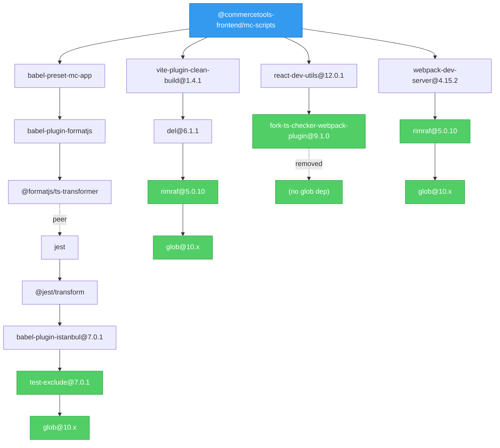

# ADR: Inflight Vulnerability (SNYK-JS-INFLIGHT-6095116) Mitigation

## Status

**Resolved** - All vulnerability paths in published packages have been eliminated.

## Context

### The Vulnerability

[SNYK-JS-INFLIGHT-6095116](https://security.snyk.io/vuln/SNYK-JS-INFLIGHT-6095116) is a **Medium Severity** Regular Expression Denial of Service (ReDoS) vulnerability in the `inflight` package.

- **Package**: `inflight`
- **Severity**: Medium
- **Last Updated**: November 2024 (abandoned)
- **Fix Available**: No - the package is unmaintained

### Why This Is Problematic

The `inflight` package is a transitive dependency of `glob@7.x` and `glob@8.x`. Starting with `glob@9.x`, the maintainer removed the `inflight` dependency entirely. However, many packages in the ecosystem still depend on older glob versions.

The glob maintainer has explicitly stated they will not backport fixes to v7/v8.

### Impact on This Repository

The vulnerability affects `@commercetools-frontend/mc-scripts`, which is shipped to users building Merchant Center customizations. While the vulnerable code only runs at **build time** (not runtime in production), Snyk policies require resolution within SLA.

## Pre-Mitigation State

### Glob Versions Present

| Version     | Has `inflight` | Status     |
| ----------- | -------------- | ---------- |
| glob@7.2.3  | Yes            | Vulnerable |
| glob@8.1.0  | Yes            | Vulnerable |
| glob@10.4.5 | No             | Safe       |
| glob@11.0.3 | No             | Safe       |

### Dependency Chains to `inflight`


### Paths Through mc-scripts (Pre-Mitigation)


## Mitigation Applied

### Changes Made

#### 1. Root `package.json` - Targeted pnpm Overrides

```json
{
  "pnpm": {
    "overrides": {
      "test-exclude": "^7.0.1",
      "flat-cache>rimraf": "^5.0.10",
      "del>rimraf": "^5.0.10",
      "webpack-dev-server>rimraf": "^5.0.10",
      "react-dev-utils>fork-ts-checker-webpack-plugin": "^9.1.0"
    }
  }
}
```

| Override                                                | Reason                                |
| ------------------------------------------------------- | ------------------------------------- |
| `test-exclude@^7.0.1`                                   | Uses glob@10 internally (no inflight) |
| `flat-cache>rimraf@^5.0.10`                             | rimraf@5 uses glob@10                 |
| `del>rimraf@^5.0.10`                                    | rimraf@5 uses glob@10                 |
| `webpack-dev-server>rimraf@^5.0.10`                     | rimraf@5 uses glob@10                 |
| `react-dev-utils>fork-ts-checker-webpack-plugin@^9.1.0` | v9 removed glob dependency entirely   |

#### 2. `packages/codemod` - Direct Upgrade

- Upgraded `glob` from `8.1.0` to `^10.5.0`
- Removed `@types/glob` (glob@10 includes TypeScript types)
- Updated code from `glob.sync()` to `globSync()` (API change in v10)

```typescript
// Before
import glob from 'glob';
const files = glob.sync(pattern, options);

// After
import { globSync } from 'glob';
const files = globSync(pattern, options);
```

#### 3. `packages/babel-preset-mc-app` - Remove `babel-plugin-lodash`

The final vulnerability path was through `babel-plugin-lodash@3.3.4 → glob@7.2.3 → inflight@1.0.6`.

**Analysis**: The codebase already uses direct lodash imports (e.g., `import omit from 'lodash/omit'`), which is the optimized tree-shaking pattern. The `babel-plugin-lodash` plugin's purpose was to transform `import { x } from 'lodash'` → `import x from 'lodash/x'`, but since the codebase didn't use that pattern, the plugin was redundant.

**Changes made**:

- Removed `babel-plugin-lodash` from `packages/babel-preset-mc-app/package.json`
- Removed plugin reference from `packages/babel-preset-mc-app/create.js`

### Post-Mitigation State



## Verification

After all mitigations, `pnpm why inflight --filter @commercetools-frontend/mc-scripts` returns empty, confirming that `inflight` is no longer in the dependency tree of the published package.

**Note**: The `inflight` package may still appear in the workspace's root development dependencies (e.g., `@babel/cli`, `@cypress/code-coverage`, `@graphql-codegen/*`), but these are not shipped with published packages.

## Decision

**Implemented**: Remove `babel-plugin-lodash` entirely.

### Rationale

1. **The plugin was redundant**: The codebase already uses direct lodash imports (`import x from 'lodash/x'`), which is the pattern the plugin would transform to
2. **No bundle size impact**: Since imports were already optimized, removing the plugin has no effect on output bundle sizes
3. **Eliminates the vulnerability**: Removes the last `inflight` dependency path from published packages
4. **Reduces build dependencies**: One fewer babel plugin to maintain

### Lodash Usage in This Codebase

| Metric             | Value                                  |
| ------------------ | -------------------------------------- |
| Files using lodash | 19                                     |
| Unique functions   | 14                                     |
| Import style       | Direct imports (`lodash/functionName`) |

**Functions used**: `upperFirst`, `isNil`, `omitBy`, `omit`, `isNumber`, `cloneDeep`, `get`, `has`, `mapValues`, `set`, `snakeCase`, `throttle`, `uniq`, `unset`

### Future Considerations

To prevent future developers from using non-optimized lodash imports, consider adding an ESLint rule:

```javascript
"no-restricted-imports": ["error", {
  "paths": [{
    "name": "lodash",
    "message": "Import from 'lodash/functionName' directly for tree-shaking."
  }]
}]
```

## References

- [SNYK-JS-INFLIGHT-6095116](https://security.snyk.io/vuln/SNYK-JS-INFLIGHT-6095116)
- [glob v10 migration guide](https://github.com/isaacs/node-glob/blob/main/changelog.md)
- [inflight deprecation notice](https://www.npmjs.com/package/inflight)
