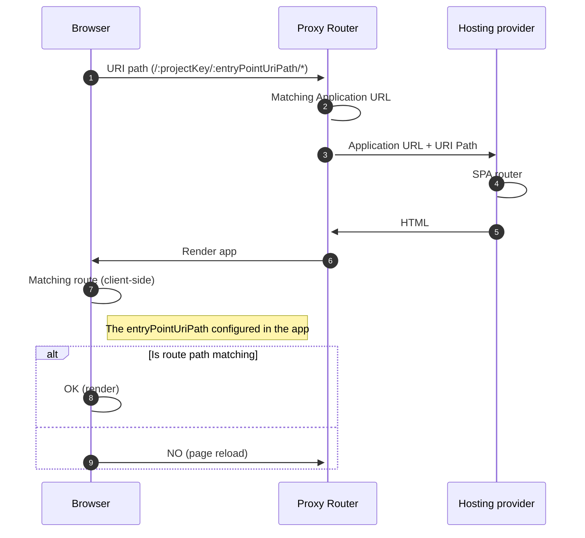

When you navigate through the Merchant Center, you can switch between the different Custom Applications available in your Projects, no matter if they are commercetools applications or something developed externally.

You might have noticed that the URL of the Merchant Center is always using the same origin, and only the URI part changes depending on the Project and application.

```
https://mc.<cloud-region>.commercetools.com/:projectKey/dashboard
https://mc.<cloud-region>.commercetools.com/:projectKey/products
https://mc.<cloud-region>.commercetools.com/:projectKey/orders
https://mc.<cloud-region>.commercetools.com/:projectKey/avengers
```

This way, it looks like you're using a single web application, even though there are multiple Custom Applications underneath. Let's understand how this works.

# Server-side routing

When the user accesses the Merchant Center through the browser, the request to render the page goes through a server component called **Merchant Center Proxy Router**.<br />
This server is primarily responsible for matching the incoming request to the appropriate Custom Application using the `entryPointUriPath` ([the identifier of the Custom Application](/api-reference/application-config#entrypointuripath)). The request then is [forwarded](#forwarding-requests) to the actual [URL location of the Custom Application](/api-reference/application-config#envproductionurl), which responds with the `index.html`.

<Info>

A Custom Application is a Single-Page Application that uses client-side routing, so you need to configure your hosting provider to rewrite all requests to serve the `index.html`. Conceptually it would mean something like this: `/* --> /index.html`. See [forwarding requests](#forwarding-requests) for more detailed information.

</Info>


Given the diagram above, a request goes through the following steps:

1. User accesses the Merchant Center at the following path `/my-project/my-app`.
2. The request goes through the Proxy Router, which successfully matches the `my-app` identifier for the `my-project` Project.
3. The configuration for the Custom Application `my-app` is loaded.
4. The request is [forwarded](#forwarding-requests) to the URL of the server hosting the Custom Application.
5. The server hosting the Custom Application responds with the `index.html`.
6. The Custom Application `my-app` is rendered in the browser.

## Forwarding requests

When the Merchant Center Proxy Router matches a request to a Custom Application, it forwards the original request URI to the Custom Application's configured URL.

```
# FROM
https://mc.<cloud-region>.commercetools.com/:projectKey/:entryPointUriPath/*

# TO
https://<app-url>/:projectKey/:entryPointUriPath/*
```

The `<app-url>` is the Custom Application [production URL](/api-reference/application-config#envproductionurl).

Therefore, the hosting server of the Custom Application must configure URL rewrite rules to handle all requests and serve the `index.html`.

For example, given the following data:
* Application production URL: `https://avengers.netlify.app`
* Application `entryPointUriPath`: `avengers`

When the user accesses the application in the Merchant Center at `https://mc.<cloud-region>.commercetools.com/:projectKey/avengers`, the Merchant Center Proxy Router forwards the request to the URL `https://avengers.netlify.app/:projectKey/avengers`.

Similarly, any of the following example URLs should always return the `index.html`:

```
https://avengers.netlify.app
https://avengers.netlify.app/:projectKey/avengers
https://avengers.netlify.app/:projectKey/avengers/new
https://avengers.netlify.app/:projectKey/avengers/123/teams
```

<Info>

Configuring rewrite rules is specific to each hosting provider but the concept is the same.

Check out the [Deployment Examples](/deployment-examples) section for more information about configuring the rewrite rules for each hosting provider.

</Info>

# Client-side routing

After the browser finishes rendering the `index.html`, the Custom Application uses client-side routing to handle the URI location path.

Each Custom Application has a built-in router and a default route match for the path `/:projectKey/:entryPointUriPath`. The value of the `entryPointUriPath` is defined in the [Custom Application config file](/api-reference/application-config) and exposed via the `window.app` [runtime environment](/api-reference/application-config#runtime-application-environment). 

Hence, the runtime value of the `entryPointUriPath` must match the value defined in the [Custom Application configuration in the Merchant Center](https://docs.commercetools.com/merchant-center/managing-custom-applications).

For example, if the `entryPointUriPath` is `avengers` when the user accesses the URL `/my-project/avengers`, the Custom Application renders correctly as the route matches.

```js
https://mc.<cloud-region>.commercetools.com/:projectKey/avengers
// avengers

window.app.entryPointUriPath
// avengers
```

## Page reloading behavior

Each Custom Application defines its routes. However, there might be links to other applications that the Custom Application routes won't match. The same applies when the user clicks on the menu links in the Merchant Center main navigation.

When no route matches the new URI path, the Custom Application forces a full page reload, and the request goes through the Merchant Center Proxy Router, letting the [server-side router](#server-side-routing) handle the matching of the route. In most cases, this results in rendering a different Custom Application.



<Warning>

Use the same `entryPointUriPath` value in the Custom Application config file and the Merchant Center configuration.

If there's a mismatch, the client-side routing will force a page reload to let the Merchant Center Proxy Router handle the route match, which renders the same application again, causing infinite reloads.
<br />

You can detect the reloading issue by inspecting the value of `window.app.entryPointUriPath` in the browser's dev tools and comparing it with the value in the URI path.

```js
https://mc.<cloud-region>.commercetools.com/:projectKey/avengers
// avengers

window.app.entryPointUriPath
// avengers-2
```

</Warning>

# Security Headers

The Merchant Center Proxy Router enforces the following HTTP security headers when serving the response from the Custom Application location:

```
Referrer-Policy: 'same-origin'
Strict-Transport-Security: 'max-age=31536000'
X-Content-Type-Options: 'nosniff'
X-Frame-Options: 'DENY'
X-XSS-Protection: '1; mode=block'
```

# Related

For more information on what to do next, we recommend the following sections:

<Cards smallTitle clickable>
  <Card
    title="Going to Production"
    href="/development/going-to-production"
  >
    Learn more about preparing your Custom Application for production.
  </Card>
  <Card
    title="CLI"
    href="/api-reference/cli"
  >
    Learn more about using the Custom Applications CLI.
  </Card>
</Cards>
