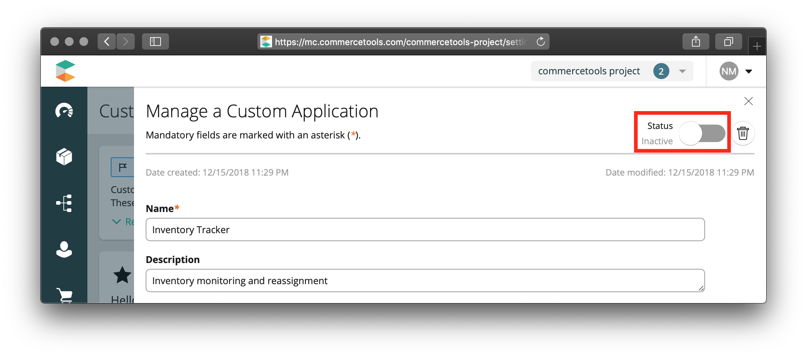
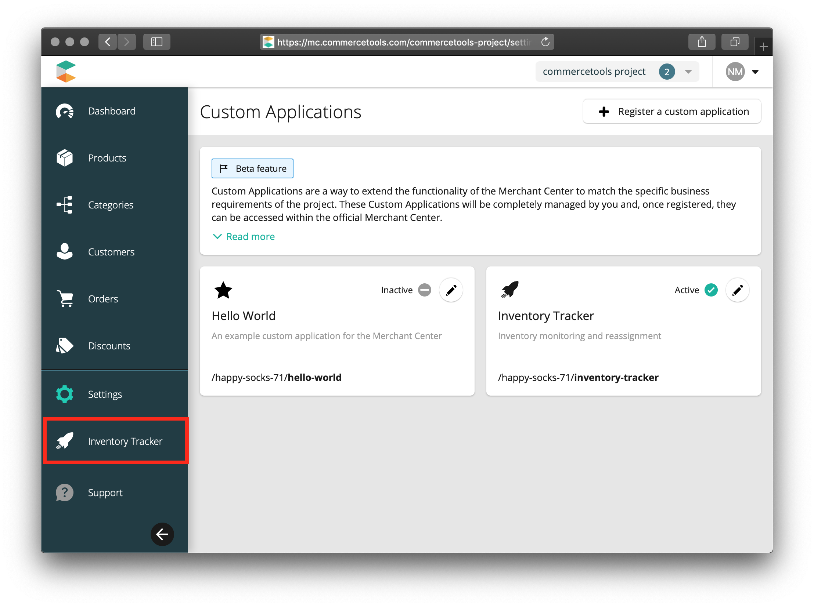

By default, all custom applications are **inactive** when [created](./configuring-a-custom-application). To **activate** a custom application:

1. Open a custom application's detail page by clicking on the **Edit** button.
2. Click the **Status** toggle in the upper right to **activate** the application.
   
3. In the confirmation dialog, click **Confirm**.

The activated application is now visible in the left-hand navigation and is **Active** and ready to be used.

